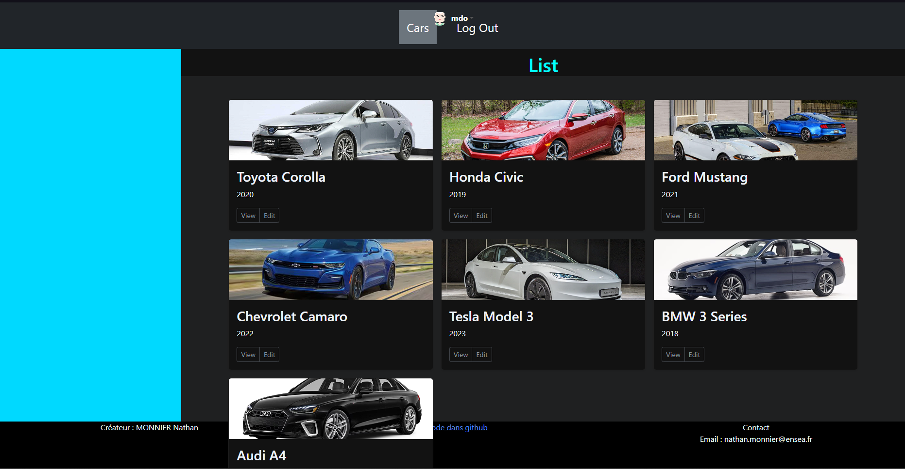

# Dossier pour le cours de développement Web

## Table des matières
- [Visualisation actuel](#la-page-actuellement)
- [Réalisation du TP](#le-TP)
- [Crédits](#crédits)

## Le TP

Les fichiers pour le tp sont :
 - Rest_API.js
 - database.js
 - users.js
 - usersControllers.js
 - seed.js

## La page actuellement

<!--Vous pouvez voir la page en action ici : [Voir la page HTML](page.html)
<iframe src="page.html" width="100%" height="500"></iframe>-->

## Crédits
Ce projet a été créé par MONNIER Nathan.
